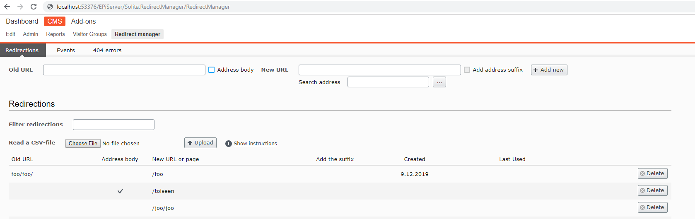
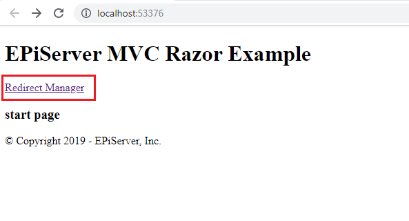

# Redirect Manager
[?branchName=master)](https://solita-episerver-public.visualstudio.com/episerver-redirect-manager/_build/latest?definitionId=6&branchName=master)

Redirect Manager is an Episerver CMS helper utility to define url redirections and manage them with a graphical user interface
Redirect Manager menu is available at CMS section for defined roles


Solita.RedirectManager.TestProject is a sample project to demonstrate how to use Redirect Manager.


To allow specific roles for access define a location set authorization at web.config file
````
<location path="EPiServer/Solita.RedirectManager">
    <system.web>
        <authorization>
            <allow roles="WebAdmins, Administrators" />
            <deny users="*" />
        </authorization>
    </system.web>
</location>
````

## Features
- Add/Remove redirection rules
- Wildcard pattern matching
- Import redirection rules from CVS file
- Display specific rule's last match datetime

## How it works:
Configure your site to route HTTP 404 errors
````
<httpErrors errorMode="Custom">
    <remove statusCode="404" />
    <error statusCode="404" path="/error/http404" responseMode="ExecuteURL" />
</httpErrors>
````
At handler apply redirect rules
````
 public class HttpErrorPageController : Controller
    {
        [Route("error/http404")]
        public ActionResult Http404()
        {
            var rewritemapService = ServiceLocator.Current.GetInstance<RewritemapService>();

            var originalUrl = IisErrorUrlParser.GetOriginalUrl(System.Web.HttpContext.Current.Request.Url, 404);
            var redirectTo = rewritemapService.FindRedirectUrl(originalUrl.Host, originalUrl.PathAndQuery, true);
            if (redirectTo != null)
            {
                return RedirectPermanent(redirectTo);
            }
            Response.Clear();
            Response.StatusCode = (int) HttpStatusCode.NotFound;
            return Content("404 Not found");
        }
    }
````

## Further development
- Build solution using configuration **DevDeploy**
    - DevDeploy configuration packages *Solita.RedirectManager* project
    - Copies the required build artifacts to *Solita.RedirectManager.TestProject* project
    - This way changes in the redirect manager project are available immediatelly in the test project after build

# Tests
All unit tests should be green. Otherwise there is something wrong with core functionalities

## Build targets
Custom build targets are defined in **Solita.RedirectManager.csproj** file(in the end). The custom build targets are activated only if "DevDeploy" configuration is selected
